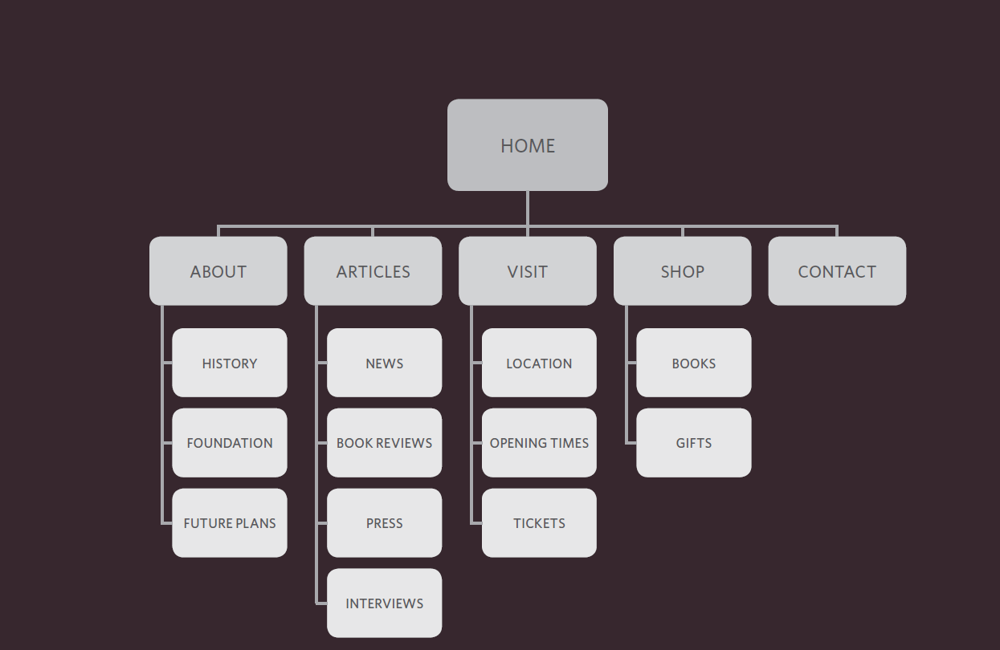
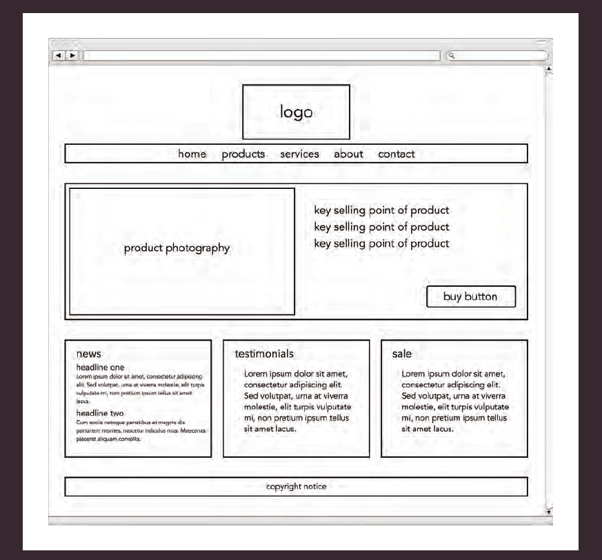

# Read01

## Structure
(HTML) HyperText Markup Language : describes the structure of pages. 
HTML elements are defined within tags that look like this <> tags are used based on what we want to appear on the web page . 
They are defined within tags that look like this <> tags are used based on what we want to appear on the web page. 
Each component has an opening tag and closing tag, and some components are self closing
They contain attributes that determine how the content of that element will appear on the web page

 > <TagName AttributeName="Attribute Value">text </Tag_Name>

## Extra Markup
Since the Web's first inception, there have been several different versions of HTML such as HTML 4, XHTML 1.0 and HTML5
* To specify the version the command DOCTYPE is used. For HTML5 the command is "<!DOCTYPE html>"
* If you want to add a comment to your code that will not be visible in the user's browser "<!-- your comment -->"
* Each element can have a unique ID that differs from the other elements "<TagName id="IDName">"
* A group of elements can be defined by adding a Class with the same name to a group of elements "<TagName class="ClassName">"
* Some elements will always appear to start on a new line in the browser window. These are known as block level elements "<h1>, 
,<ul>, <li>".
* Some elements will always appear to continue on the same line as their neighbouring elements, These are known as inline elements "<a>, <b>, <em>, ".
* The 
 element allows you to group a set of elements together in one block-level box.
* The  element acts like an inline equivalent of the 
 element.
* An iframe is like a little window that has been cut into your page  and in that window you can see another page"<iframe>....</iframe>"
* The <meta> element lives inside the <head> element and contains information about that web page.
* Escape characters are used to include special characters in your pages such as <, >, and ©.
## HTML5 Layout
By HTML5 you can divide up your web page
* The header element contains the main site name and navigation bar <header>.
* The footer element contains copyright information <footer> .
* The nav contains the primary site navigation <nav>. 
* The article element acts as a container for any section of a page that could stand alone and potentially be syndicated <article>.
* The <aside> element can be used two purposes:
    *  When the <aside> element is used inside an <article> element, it should contain information that is related to the article but not essential to its overall meaning.
    * When the <aside> element is used outside of an <article> element, it acts as a container for content that is related to the entire page.

* The section element groups related content together, and typically each section would have its own heading <section>.
* The elements figure and figcaption use for insert content like charts, images and  videos <figure>,<figcaption>.

## Process & Design
* It's important to understand who your target audience is, why they would come to your site, what information they want to find and when they are likely to return .
* Site maps allow you to plan the structure of a site.
;
* A wireframe is a simple sketch of the key information that needs to go on each page of a site. 
;
* ** Visual hierarchy ** refers to the order in which your eyes perceive what they see It is created by adding visual contrast between the items being displayed. 
* Site navigation not only helps people find where they want to go, but also helps them understand what your site is about and how it is organized
