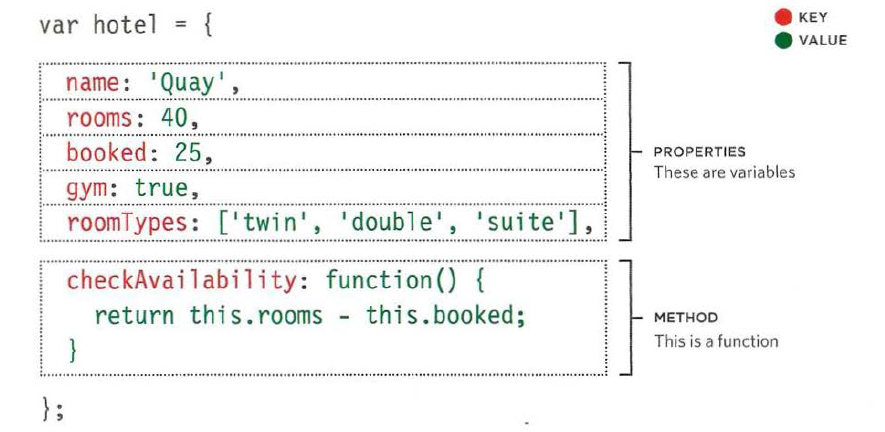
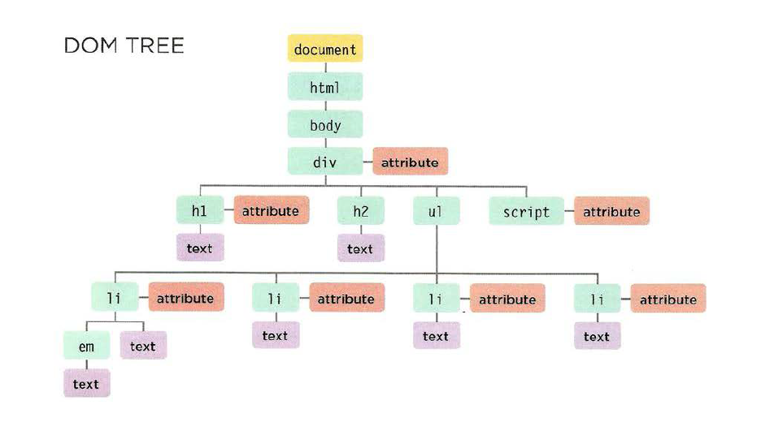
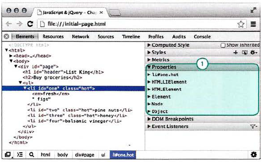

# read 6

## Object Literals
* Objects group together a set of variables and functions to create a model of a something you would recognize from the real world.
* If a variable is part of an object, it is called a property.
* If a function is part of an object, it is called a method.
;

## Document Object Model
* The browser represents the page using a DOM tree.
;
* DOM trees have four types of nodes: document nodes, element nodes, attribute nodes, and text nodes.
* You can select element nodes by their id or cl ass attributes, by tag name, or using CSS selector syntax.
```getElementByld(id), querySelector(css selector), getElementsByClassName(class), getElementsByTagName(tagName), querySelectorAll(css selector)```
* Whenever a DOM query can return more than one node, it will always return a Nadel i st.
* From an element node, you can access and update its content using properties such as textContent and innerHTML or using DOM manipulation techniques.
    **DOM manipulation can be used to remove elements from the DOM tree.**
    * STORE THE ELEMENT TO BE REMOVED IN A VARIABLE
    * STORE THE PARENT OF THAT ELEMENT IN A VARIABLE
    * REMOVE THE ELEMENT FROM ITS CONTA INING ELEMENT
* An element node can contain multiple text nodes and child elements that are siblings of each other.
* In older browsers, implementation of the DOM is inconsistent (and is a popular reason for using jQuery).
* Browsers offer tools for viewing the DOM tree .
    * Firefox has similar built-in tools, but you can also download a DOM inspector tool that shows the text nodes.
    * Modern browsers come with tools that help you inspect the page loaded in the browser and understand the structure of the DOM tree.
    ;