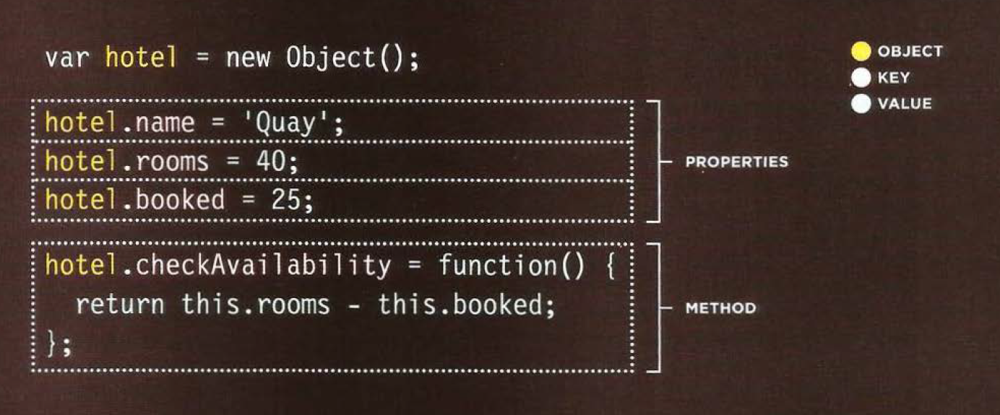
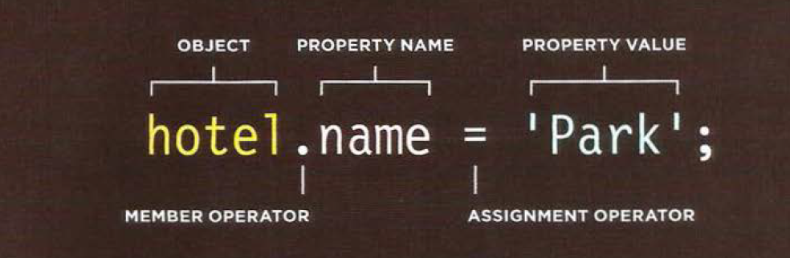
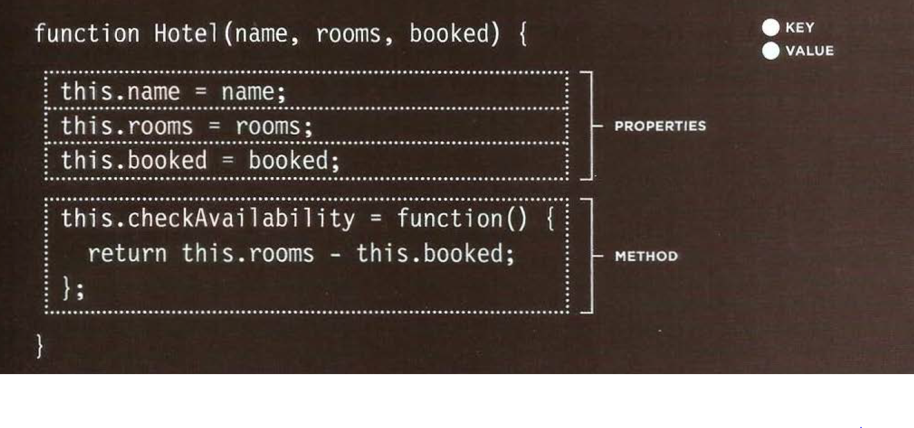

# read 6


  ## Tables
  #### A table represents information in a grid format. **Examples of tables include financial reports, TV schedules, and sports results.**
  * The ```<table>``` element is used to create a table. The contents of the table are written out row by row.
  * You indicate the start of each row using the opening ```<tr>``` tag. 
  * Each cell of a table is represented using a ```<td>``` element.
  * The `<th>` element is used just like the `<td>` element but its purpose is to represent the heading for either a column or a row.
  * The colspan attribute can be used on a `<th>` or `<td>` element and indicates how many columns that cell should run across.
  * The headings of the table should sit inside the `<thead>` element.
  * The body should sit inside the `<tbody>` element.
  * The footer belongs inside the `<tfoot>` element.
  * The value of this attribute is the width of the table or cell in pixels.


## Functions, Methods, and Objects
* Creating an object: constructor notation
;
* To update the value of properties, use dot notation or square brackets.
;
* CREATING MANY OBJECTS: Sometimes you will want several objects to represent similar things.
;
* CREATE & ACCESS OBJECTS: To get a better idea of why you might want to create multiple objects on the same page.
* The keyword this is commonly used inside functions and objects.
* Web browsers implement objects that represent both the browser window and the document loaded into the browser window.
* JavaScript also has several built-in objects such as String, Number, Math, and Date. Their properties and methods offer functionality that help you write scripts.
* Arrays and objects can be used to create complex data sets (and both can contain the other).