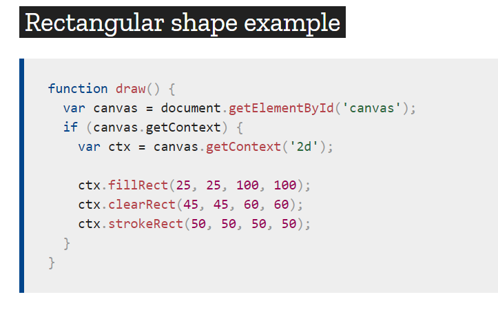
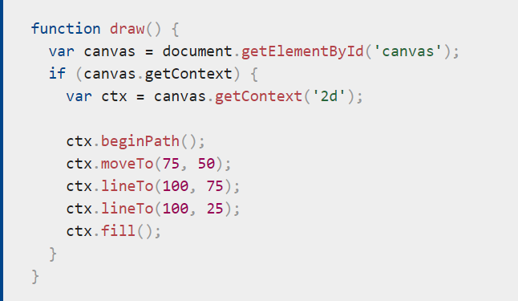
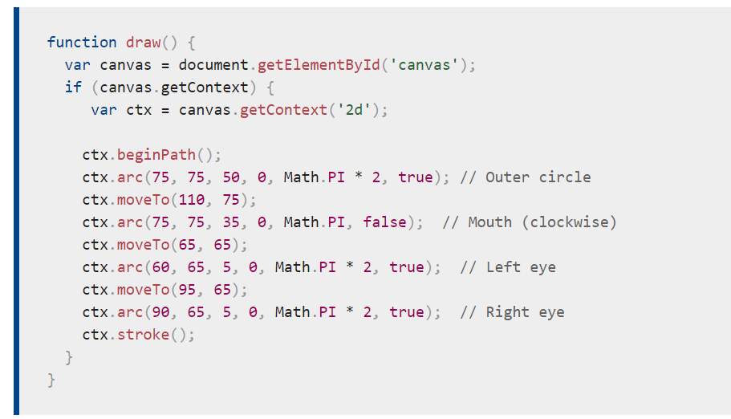

# Read 12

## Chart.js API
* Charts are far better for displaying data visually than tables and have the added benefit that no one is ever going to press-gang them into use as a layout tool.
* **Drawing a line chart** To draw a line chart, the first thing we need to do is create a canvas element in our HTML in which Chart.js can draw our chart.

## Canvas API
* Basic usage The `<canvas>` element creates a fixed-size drawing surface that exposes one or more rendering contexts, which are used to create and manipulate the content shown.
* Drawing shapes with canvas
**Rectangular shape**
 ;
**Drawing a triangle**
;
**Moving the pen**
;
## Applying styles and colors
**Colors**
Up until now we have only seen methods of the drawing context. If we want to apply colors to a shape, there are two important properties we can use: fillStyle and strokeStyle.
**Transparency**
In addition to drawing opaque shapes to the canvas, we can also draw semi-transparent (or translucent) shapes. 
- The `lineJoin` property determines how two connecting segments (of lines, arcs or curves) with non-zero lengths in a shape are joined together (degenerate segments with zero lengths, whose specified endpoints and control points are exactly at the same position, are skipped).

## Drawing text
The canvas rendering context provides two methods to render text:

`fillText(text, x, y [, maxWidth])`
Fills a given text at the given (x,y) position. Optionally with a maximum width to draw.
`strokeText(text, x, y [, maxWidth])`
Strokes a given text at the given (x,y) position. Optionally with a maximum width to draw.
